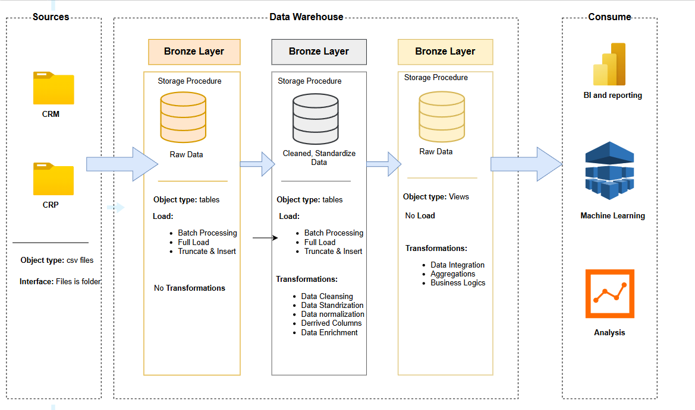

# data-warehouse-sql-server-project

A structured framework for building scalable, layered data pipelines in SQL Server. It provides foundational schemas, scripts, and automation to organize raw, cleansed, and business-ready data—accelerating integration, transformation, and analytics.

---

## Table of Contents

- [Why This Project?](#why-this-project)  
- [Features](#features)  
- [Architecture](#architecture)  
- [Getting Started](#getting-started)  
  - [Prerequisites](#prerequisites)  
  - [Installation](#installation)  
- [Usage](#usage)  
- [Project Structure](#project-structure)  
- [Contributing](#contributing)  
- [License](#license)  

---

## Why This Project?

Building a production-grade data warehouse can feel overwhelming. This project streamlines the process by giving you:  
- A clear, layered schema design  
- Prebuilt ETL scripts for raw ingestion and transformation  
- Modular views and tables tailored for reporting  
- Room to customize and extend  

---

## Features

- **Layered Data Architecture**  
  - **Bronze**: Raw, unmodified source data staging  
  - **Silver**: Cleansed and standardized datasets  
  - **Gold**: Business-ready tables and views for analytics  
- **Automated ETL**  
  - Batch scripts orchestrate data flows end-to-end  
- **Schema & View Definitions**  
  - Declarative SQL files you can tweak  
- **Open-Source Flexibility**  
  - Fork, extend, and integrate with your tooling  

---

## Architecture

1. **Bronze**: Raw extracts land here.  
2. **Silver**: Data is cleaned, validated and standardized.  
3. **Gold**: Aggregated, conformed tables and views for BI tools.

---
